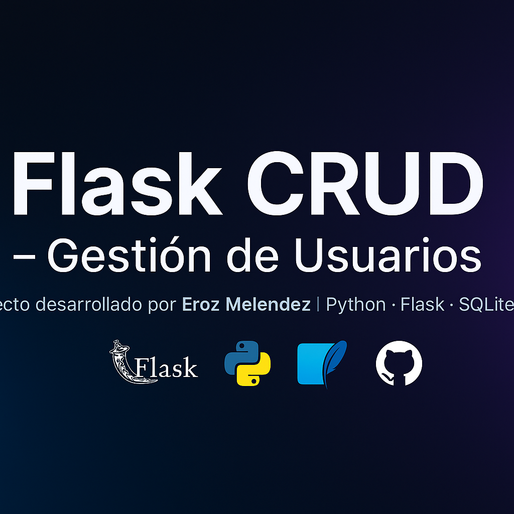

  

 # 🧩 Flask CRUD – Gestión de Usuarios

Aplicación web desarrollada con **Flask (Python)** que implementa un sistema **CRUD (Create, Read, Update, Delete)** para gestionar usuarios en una base de datos SQLite.  
Diseñada con una interfaz moderna basada en **Bootstrap 5**, validaciones de formularios y manejo de mensajes Flash.

---

## 🚀 Características principales

✅ Crear nuevos usuarios  
✅ Listar todos los usuarios registrados  
✅ Editar información de un usuario  
✅ Eliminar usuarios existentes  
✅ Validaciones en los formularios (correo, edad, duplicados)  
✅ Interfaz moderna y responsiva con Bootstrap  

---

## 🛠️ Tecnologías utilizadas

- **Python 3.13**
- **Flask 3.1.2**
- **SQLite3**
- **Bootstrap 5**
- **HTML5 / CSS3**
- **Git & GitHub**

---

## 📂 Estructura del proyecto

flask_project/
│
├── app.py # Archivo principal con rutas y lógica
├── requirements.txt # Dependencias del proyecto
├── .gitignore # Archivos y carpetas ignoradas por Git
├── templates/ # Vistas HTML (formulario, usuarios, editar)
│ ├── base.html
│ ├── formulario.html
│ ├── usuarios.html
│ └── editar.html
├── static/ # Archivos estáticos (CSS, JS, imágenes)
├── datos.db # Base de datos SQLite
└── run.sh # Script de ejecución (opcional)